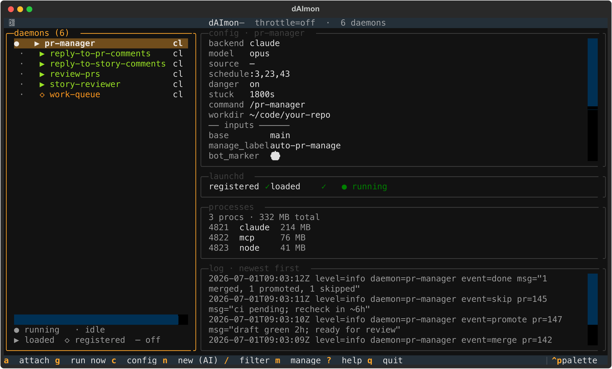

<p align="center">
  
</p>

<h1 align="center">dAImon</h1>

<p align="center">
  <a href="https://github.com/effekt/dAImon/actions/workflows/ci.yml"></a>
  <a href="LICENSE"></a>
</p>

Scheduled, autonomous agent daemons. Each daemon fires on a schedule, launches an
interactive Claude CLI inside a detached tmux session pointed at a
target repository, drives it with a slash-command, and blocks until the run
finishes or goes idle — no wall-clock cap, just an idle-gap reaper. A watchdog
sweeps orphans and leaked MCP servers; a Textual TUI is the control panel.

<p align="center">
  
</p>

## Concepts

- **Daemon** — a self-contained folder `daemons/<slug>/` with `daemon.toml`
  (settings + task `[inputs]`), `discover.sh` (a gate: should this fire do work?),
  and `skill/SKILL.md` (the prompt). Auto-discovered; drop one in and it exists.
- **Backend** — the agent CLI that drives the session. `claude` ships today;
  pluggable via `backends/<name>.sh`.
- **working_dir** — the repository a daemon operates in. The agent runs *inside*
  that trusted folder so it gets project context, MCP servers, and project skills.
  One daemon targets one repo; run many repos by registering one daemon per repo.
- **Completion/liveness** — Claude signals done via a Stop hook (a sentinel file);
  liveness via a heartbeat touched on every tool call. A backend without such a
  hook can fall back to idle detection backed by a pane-activity heartbeat.

## Prerequisites

- **macOS** for scheduled runs — daemons are scheduled with `launchd`. On Linux you
  can clone and `daimon run <slug>` manually, but `install --load` (launchd) and the
  TUI's scheduling controls won't work. (systemd support isn't there yet.)
- **Python 3.12+** — the core runtime is stdlib-only (no pip needed for it).
- **tmux** — each run drives the agent inside a detached tmux session.
- **Claude CLI** (`claude`) — the default backend. Set `DAIMON_CLAUDE_BIN` if it's off PATH.
- **gh** — for the GitHub daemons (`gh auth login`).
- **jq** — used by the GitHub discovery gates.

macOS: `brew install python@3.12 tmux gh jq` (plus the [Claude CLI](https://docs.claude.com/en/docs/claude-code/overview)).
`make doctor` verifies all of the above.

## Quick start

```bash
git clone <your-fork> ~/dev/dAImon
cd ~/dev/dAImon
make install                 # hooks, TUI venv, skills, plists (not scheduled); puts `daimon` on PATH
daimon init                  # pick which daemons to run + scaffold their local config
$EDITOR ~/.config/daimon/daimon.toml                       # globals: install_root, state_dir, defaults
$EDITOR daemons/review-prs/daemon.local.toml               # set working_dir to your repo (gitignored)
make doctor                  # verify tools, gh auth, hooks, config
make validate
daimon run review-prs        # one gated run, now — watch with `daimon tui`
make install-load            # schedule everything via launchd (macOS only)
```

`make install` symlinks `daimon`/`daimonctl` into `~/.local/bin` (ensure it's on your
PATH); `make help` lists targets.

### Shared vs machine-local config

Each daemon splits its config in two: **`daemon.toml`** (committed — shared defaults,
schedule, task inputs) and **`daemon.local.toml`** (gitignored — your `working_dir`
and any per-machine overrides). Edit the `.local.toml` copies and never commit them.
Source-wide settings (e.g. your Shortcut `owner`/`team`) live the same way in
`profiles/<name>/profile.local.toml`. API tokens are never stored in these files —
use `gh auth login` and `$SHORTCUT_API_TOKEN`.

`daimon init` defines which daemons run on this machine: name the ones you want and
the rest are added to `[daemons].disabled` (excluded from sync and scheduling), and
the chosen ones get their `.local.toml` scaffolded from the tracked examples.

```bash
daimon init story-reviewer reply-to-story-comments   # run only these two
daimon init                                          # interactive picker (default: all)
```

## Adding a daemon

Two ways, both producing the same `daemons/<slug>/` folder:

1. **Interactive** — run `/daimon-builder` in Claude; it interviews you and writes
   the folder.
2. **By hand** — copy an existing `daemons/<slug>/`, edit `daemon.toml`, then
   `daimon sync` to regenerate its plist and render its skill.

## CLI

```
daimon run <slug>        gated run (throttle/inbox/discovery) then launch
daimon launch <slug>     launch now, bypass gates
daimon daemons           list discovered daemons
daimon status            launchd + running-session state
daimon models <backend>  available models (live API or bundled fallback)
daimon config <args>     config core (validate|get|daemon|schedule|...)
daimon sync              regenerate plists + render skills
daimon kill <slug|all>   hard-kill a run
daimon ps <slug|all>     process tree
daimon watchdog          sweep orphans + leaked MCP + old logs
daimon tui               control panel
```

## Configuration

Global settings in `~/.config/daimon/daimon.toml`; per-daemon in
`daemons/<slug>/daemon.toml`. Full field reference: [docs/configuration.md](docs/configuration.md).
Run-dangerous, model, schedule, backend, and idle timeout are all configurable
globally and per daemon.

## Logging

Per daemon, under `state_dir/logs/`: a structured operational log (`<slug>.log`)
and per-run agent transcripts (`transcripts/<slug>-<backend>-<ts>.log`).
Transcripts are pruned after `log_retention_days`; operational logs rotate at
`log_max_mb`. Cleanup runs in the watchdog cycle.

## Testing

```bash
bash tests/run.sh
```

Covers config merge/validation/rendering, model discovery, the skills validator,
and bash syntax across all libs.

## Layout

`lib/` framework · `backends/` agent CLIs · `daemons/` the daemons · `daimon/`
sync (plists + skills) · `tui/` control panel · `skills/` management commands ·
`config/` defaults + hooks · `docs/`.

## Contributing

See [CONTRIBUTING.md](CONTRIBUTING.md) for the dev setup and workflow, and
[docs/writing-a-daemon.md](docs/writing-a-daemon.md) to build your own daemon.

## License

MIT — see [LICENSE](LICENSE).
